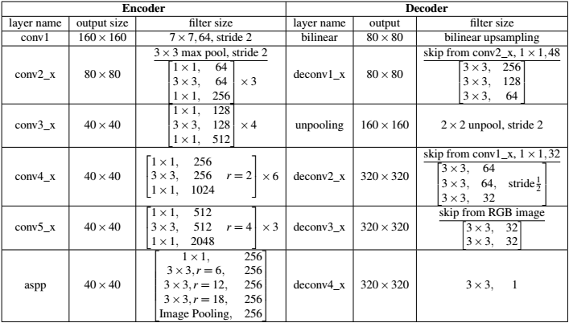
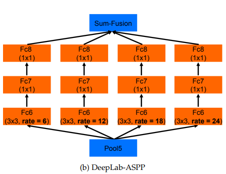
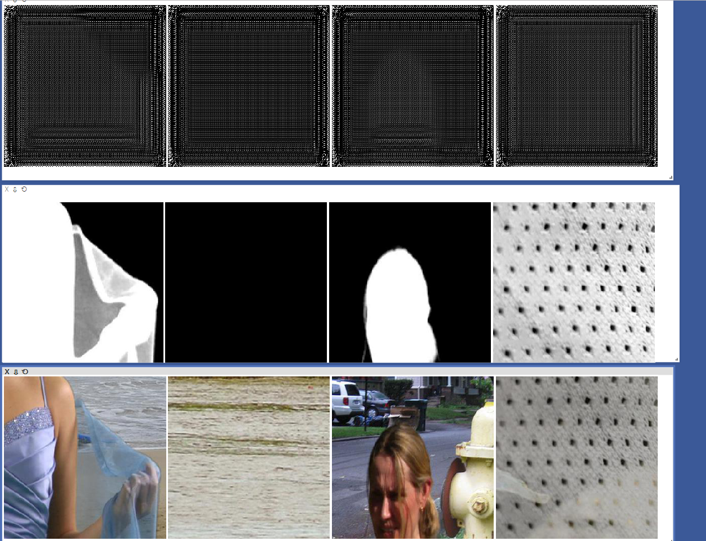
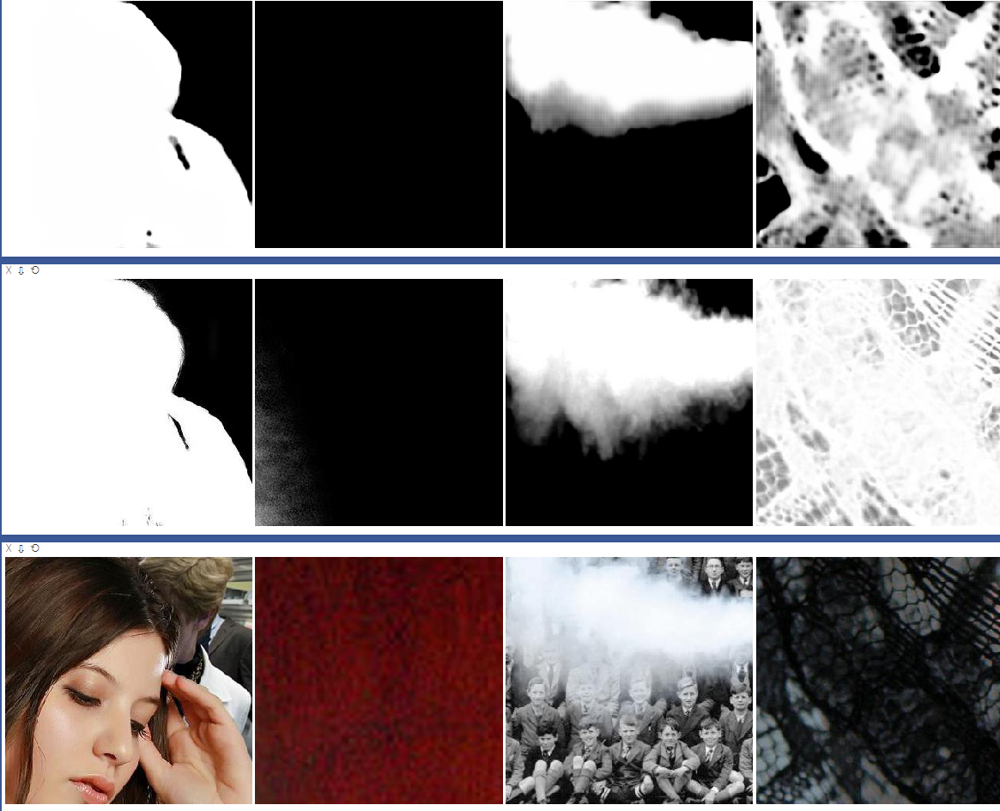
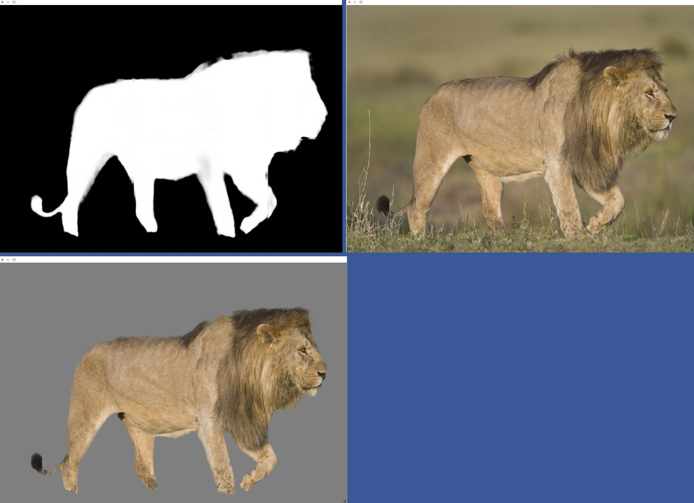
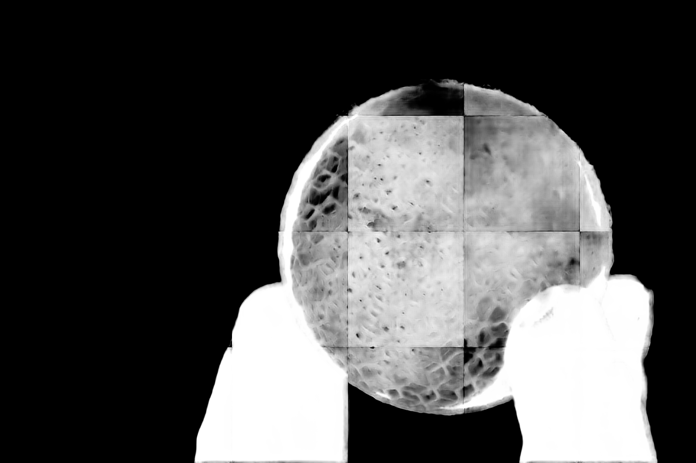
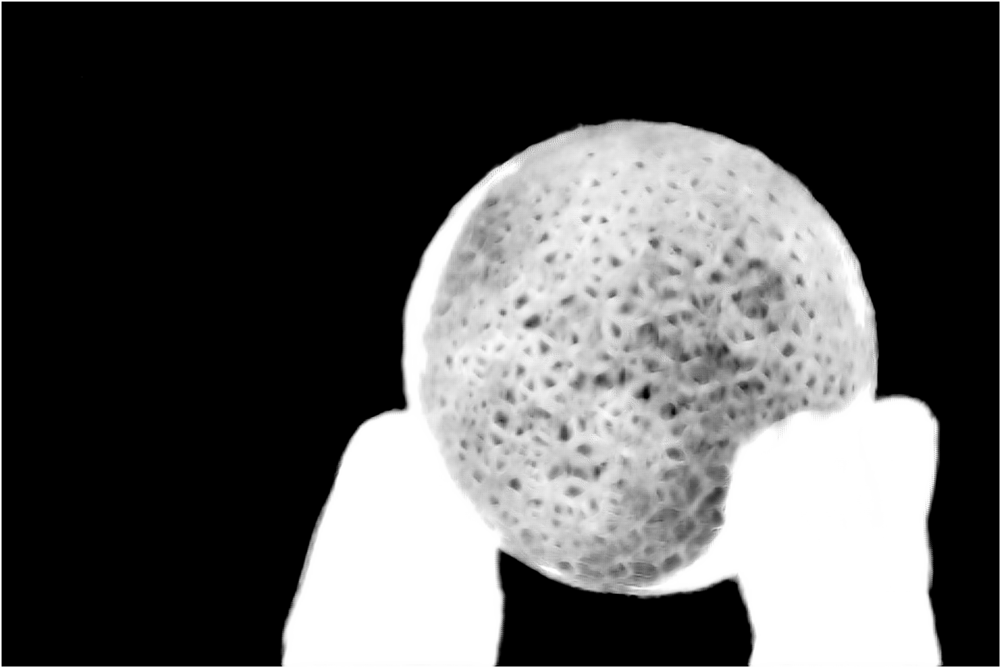
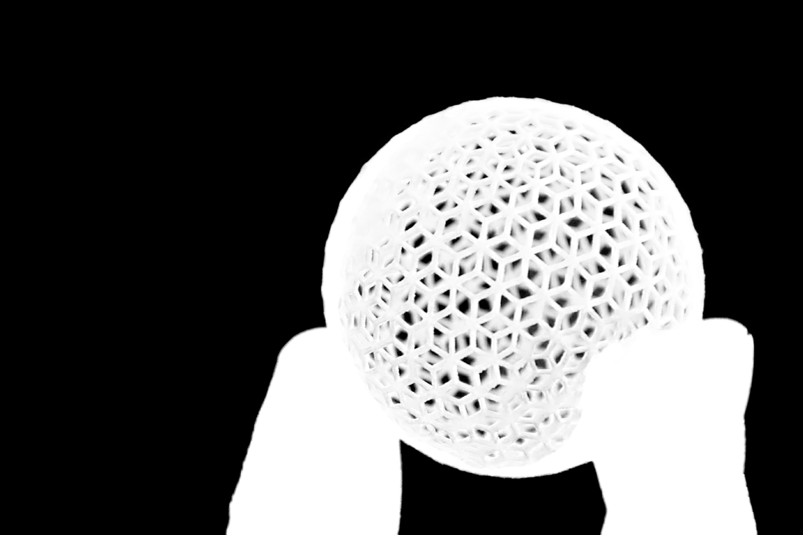

# AlphaGAN
>课程项目要求做image matting，于是找到了一篇这样的论文做image matting。刚好也对GAN比较感兴趣，GAN作为一种生成模型，至今已经在图像生成，图像风格转移等方面取得了很好的效果，那么使用GAN从trimap domain转换到alphamap domain应该是个自然的想法。

本项目是参考BMVC 2018的一篇论文
[AlphaGAN: Generative adversarial networks for natural image matting](https://arxiv.org/pdf/1807.10088.pdf)的复现。~~目前还没有采用论文中的skip connection~~。效果也不是很好，或者说效果比较差吧╮(￣▽￣)╭。

# Dependencies

- Python 3
- Pytorch 0.4
- visdom 0.1.8.5
- OpenCV

# Dataset

## Adobe Deep Image Matting Dataset

Follow the [instruction](https://sites.google.com/view/deepimagematting) to contact author for the dataset

你可能还需要按照Deep Image Matting中论文的方法在alpha mat的基础上生成trimap，这是一个别人实现的方法

```python
import numpy as np
import cv2 as cv

def generate_trimap(alpha):
    fg = np.array(np.equal(alpha, 255).astype(np.float32))
    # fg = cv.erode(fg, kernel, iterations=np.random.randint(1, 3))
    kernel = cv.getStructuringElement(cv.MORPH_ELLIPSE, (3, 3))
    unknown = np.array(np.not_equal(alpha, 0).astype(np.float32))
    unknown = cv.dilate(unknown, kernel, iterations=np.random.randint(1, 20))
    trimap = fg * 255 + (unknown - fg) * 128
    return trimap.astype(np.uint8)

```
项目中的DataSet目录结构
```Bash
Train
  ├── alpha  # the alpha ground-truth
  ├── bg     # the background image
  ├── fg     # the foreground image
  ├── input  # the real image composed by the fg & bg
  ├── trimap # the trimap
```

# Train & Test

~~等我先重构下代码再说这部分的事情╮(￣▽￣)╭~~


如果，你把目录建的和我一样那你可以直接，当然这几乎不可能~
```Bash

python alphaGAN_train.py

```
你需要设定数据的地址与模型保存的地址
```Bash

python alphaGAN_train.py --dataroot ${your_dataroot} --save_dir ${your_modelroot}

```

可视化前，你需要启动visdom服务
```Bash

python -m visdom.server

```

获得更多参数
```Bash

python alphaGAN_train.py --help

```

# Acknowledgments

代码实现借鉴了

- [pytorch-CycleGAN-and-pix2pix](https://github.com/junyanz/pytorch-CycleGAN-and-pix2pix)

- [pytorch-book](https://github.com/chenyuntc/pytorch-book) 中的GAN生成动漫头像

- [pytorch-deeplab-xception](https://github.com/jfzhang95/pytorch-deeplab-xception)

# Update

### 2018-11-26

新的ASPP结构，参考了[pytorch-deeplab-xception](https://github.com/jfzhang95/pytorch-deeplab-xception)。通过将LeakyReLU的inplace设置为False解决了RuntimeError: one of the variables needed for gradient computation has been modified by an inplace operation。现在的ASPP和论文中的结构类似了。依旧没有skip connection。结果等训好了再看看。

### 2018-11-28

我发现我之前的Discriminator的输出最后没有经过sigmoid。重构了下AlphaGAN的model。

### 2018-12-3

实现了skip connection。用最新实现的AlphaGAN.py替换了原有的模型定义文件。

# Network architecture

## Generator
AlphaGAN matting 很大程度上借鉴了[Deep Image matting](https://arxiv.org/abs/1703.03872)。几乎可以理解为AlphaGAN matting 将Deep Image matting中的深度网络拿来作为了GAN的generator，只是把encoder中的VGG换成了ResNet50，并把少部分卷积层换成了空洞卷积，以达到不减小feature map也可以增大感受野的目的。



## Discriminator

AlphaGAN matting 的discriminator采用PatchGAN。

这有个[各种Discriminator的合集](https://github.com/ChengBinJin/V-GAN-tensorflow)

# Atrous Convolution

文章借鉴了[Rethinking Atrous Convolution for Semantic Image Segmentation](https://arxiv.org/pdf/1706.05587.pdf)中的Atrous Convolution和Atrous Spatial Pyramid Pooling(ASPP)，当然这两个东西（方法？）都不是这篇论文首提的。空洞卷积的作用在于不改变feature map的大小进而增大下一层的感受野，使用空洞卷积结构的深度网络在小物体的目标识别上确实取得了不错的结果。**用到这里，可能是作者想避免generator丢失那些毛发的细节信息吧**，然而，我的复现并没有达到这种效果，理想很丰满，现实很骨感，生成的alphamat除了糊还是糊(ノ=Д=)ノ┻━┻。

更直观的理解卷积，空洞卷积[戳这里](https://github.com/vdumoulin/conv_arithmetic/blob/master/README.md)。这可是pytorch官方推荐。pytorch说明文档懒得给你解释卷积，于是让你去看别人写好的╮(￣▽￣)╭。

# Atrous Spatial Pyramid Pooling(ASPP)

空洞卷积空间金字塔？

为此，我先去查了下[空间金字塔究竟是个啥](https://blog.csdn.net/xjz18298268521/article/details/52681966)，看起来把Spatial pyramid pooling加在全连接层之前，可以让网络处理任意大小的图像输入，而不用将输入图片裁剪到一个固定的大小。

后来，我看了下相关论文中ASPP的结构，发现，这怎么好像和SPP不太一样？？？这怎么看起来像Inception结构。到网上找了个ASPP的实现，总感觉好像不太对。

后来，我打算按照下图的结构自己实现个ASPP，在ASPP的```forward```过程中，将输入分别输入到各个空洞卷积中，~~再将结果```torch.cat```到一起，结果还引发了另一个问题—— RuntimeError: one of the variables needed for gradient computation has been modified by an inplace operation。~~

原来这个RuntimeError和```torch.cat```无关。只要把LeakyReLU设置成```inplace=False```就可以了╮(￣▽￣)╭。但为什么别的LeakyReLU ```inplace=True```没有出现这个问题？薛定谔的RuntimeError

关于这个RuntimeError的解决方法有几种：

- 将```inplace=True```改成```inplace=False```
- 将 ```a += b```改成```a = a + b ```
- 回退到pytorch0.3.0版本 





# 关于GAN的训练

GAN是一个很难训练的网络模型，很可能就会出现生成结果不理想的情况。我就觉得我现在训练出的这个模型很就没训练好，生成的结果可以说几乎没有细节信息，很是模糊_(:з」∠)_。尽管文章中采用了PatchGAN作为discriminator，而PatchGAN设计的初衷就是去模糊。

在复现过程中，参看了[训练GAN的16个技巧](https://mp.weixin.qq.com/s/d_W0O7LNqlBuZV87Ou9uqw)([How to Train a GAN@NIPS2016](https://github.com/soumith/ganhacks))以及[Improved Techniques for Training GANs](https://arxiv.org/abs/1606.03498)。

- 优化器采用Adam
- 不要通过loss statistics 去平衡G与D的训练过程
- 避免稀疏梯度：ReLU, MaxPool
    
    复现中，我将原本ReLU都替换为了LeakyReLU, MaxPool都替换为了AveragePool

### 关于一些超参数

复现的时候，很大程度上参考了[CycleGAN](https://github.com/junyanz/pytorch-CycleGAN-and-pix2pix)的实现，包括PatchGAN，读入数据的input_dataset等，都是借鉴CycleGAN中的代码实现。CycleGAN在图像风格转换等方面取得非常成功的效果，该项目的开源代码写的也十分棒。因此，复现中的一些超参数和CycleGAN中的超参数一致。

同时也有一篇关于GAN全景图的论文，[The GAN Landscape](https://mp.weixin.qq.com/s?__biz=MzA3MzI4MjgzMw==&mid=2650745273&idx=1&sn=b057305f7431423adebaa519dcd23547&chksm=871aedc7b06d64d1f66d78687a721b7360f0b11f20b44b00c7d92047f137e75be20d9ffb2009&mpshare=1&scene=1&srcid=0715c3IDUOvpvCyTHgZhMDMV&pass_ticket=qgYs5vOKlc87Cj4B5uTln9ELDfWQJnTqwJO%2B5ipNoI6K7VStQ9djW9PXdfzSwMD3#rd)论文中总结了近来效果比较好的GAN的超参数。

复现中的超参数

|   Parameter   |    value    |
|     :---:     |    :---:    |
|learning rate α|    0.0002   |
|negative slope |     0.2     |
|(β1, β2)       | (0.9, 0.999)|

# Loss

AlphaGAN的损失函数由GAN的对抗损失与[Deep Image Matting](https://sites.google.com/view/deepimagematting)中提出的alpha-prediction loss和compositional loss构成，所以AlphaGAN的Loss如下：


$$ L_{AlphaGAN}(G, D) = L_{alpha}(G) + L_{comp}(G) + L_{GAN}(G, D) $$

去掉$ L_{comp} $，几轮epoch后的训练结果


去掉$ L_{comp} $，数轮epoch后的训练结果


全部Loss


$ L_{comp} $可以约束图像边缘部分的点，GAN不再生成离散的，不准确的像素点。$ L_{comp} $可以使GAN生成一个效果更好，更加连续的结果。

# Test Reslut

可以说生成结果边缘信息缺失，没有细节，非常模糊了。完全没有论文中的效果好╮(￣▽￣)╭



由于图片切割问题，会有明显的切割边缘。效果感觉还可以，但细节信息依旧不好。



不需要切割模型仍然可以处理输入的图片






